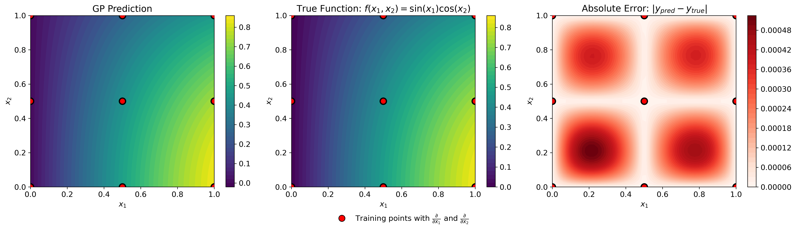

#####
JetGP
#####

A Gaussian Process library with support for arbitrary-order derivative-enhanced training data.

Installation
============

Anaconda
--------

Ensure that the Anaconda distribution is installed on your system. `Click here <https://www.anaconda.com/docs/getting-started/anaconda/install>`_ for installation steps.

Cloning the repository
----------------------

.. code-block:: bash

   $ git clone git@github.com:Samm-Py/jetgp.git

Conda environment
-----------------

Set up the dependencies of this repository using the ``environment.yml`` file.

1. Go to the root of the cloned repository. Create and activate the conda environment with the supplied ``environment.yml`` file at root:

.. code-block:: bash

   $ cd <path-to-JetGP>
   $ conda env create -f environment.yml
   $ conda activate jetgp

In the event where dependencies are added, the ``jetgp`` environment can be updated:

.. code-block:: bash

   $ conda env update --file environment.yml --prune

Add JetGP to Python Path
------------------------

To make the ``jetgp`` library importable from anywhere, it must be added to your Python path.  
There are two recommended ways to do this:

**Option 1: Temporary addition using ``PYTHONPATH``**

.. code-block:: bash

   # From  ``.\jetgp-main``
   $ export PYTHONPATH=$PYTHONPATH:$(pwd)

   # Optional: verify that JetGP is accessible
   $ python -c "import jetgp; print('JetGP successfully added to PYTHONPATH')"

To make this change permanent, add the export line to your shell configuration file (e.g., ``~/.bashrc`` or ``~/.zshrc``).

**Option 2: Persistent addition using Conda (recommended for Anaconda users)**

If using Anaconda, you can register the repository path with your environment using ``conda develop``  
(from the ``conda-build`` package):

.. code-block:: bash

   $ conda install conda-build
   $ cd <path-to-JetGP> (e.g., ``.\jetgp-main``).
   $ conda develop .

This method automatically makes ``jetgp`` importable whenever the ``jetgp`` environment is active.

Local documentation build
=========================

The documentation of the library can be built locally.

1. Ensure that the conda environment is activated:

.. code-block:: bash

   $ conda activate jetgp

2. Change directory to the ``docs`` directory and make a ``build`` directory:

.. code-block:: bash

   $ cd docs
   $ mkdir build

3. Build and open the HTML documentation (e.g., using Firefox browser):

.. code-block:: bash

   $ sphinx-build -M html source build
   $ cd build/html
   $ firefox index.html

Quick Start Examples
=====================
DEGP: Derivative-Enhanced Gaussian Process
-------------------------------------------

This example demonstrates DEGP on the 2D function :math:`f(x_1, x_2) = \sin(x_1)\cos(x_2)` using a 3×3 training grid with first and second-order coordinate derivatives.

.. code-block:: python

   import numpy as np
   from jetgp.full_degp.degp import degp
   import matplotlib.pyplot as plt
   from matplotlib.lines import Line2D

   # Ensure proper matplotlib backend
   plt.rcParams.update({'font.size': 12})

   # Generate 3x3 training grid
   X1 = np.array([0.0, 0.5, 1.0])
   X2 = np.array([0.0, 0.5, 1.0])
   X1_grid, X2_grid = np.meshgrid(X1, X2)
   X_train = np.column_stack([X1_grid.flatten(), X2_grid.flatten()])

   # Compute function values and derivatives for f(x,y) = sin(x)cos(y)
   y_func = np.sin(X_train[:,0]) * np.cos(X_train[:,1])
   y_deriv_x = np.cos(X_train[:,0]) * np.cos(X_train[:,1])
   y_deriv_y = -np.sin(X_train[:,0]) * np.sin(X_train[:,1])
   y_deriv_xx = -np.sin(X_train[:,0]) * np.cos(X_train[:,1])
   y_deriv_yy = -np.sin(X_train[:,0]) * np.cos(X_train[:,1])

   # Organize training data
   y_train = [y_func.reshape(-1,1), y_deriv_x.reshape(-1,1),
              y_deriv_y.reshape(-1,1), y_deriv_xx.reshape(-1,1),
              y_deriv_yy.reshape(-1,1)]

   # Specify derivative structure
   der_indices = [[[[1,1]], [[2,1]]],  # First-order
                  [[[1,2]], [[2,2]]]]  # Second-order

   print("Initializing DEGP model...")

.. code-block:: python

   # Initialize and optimize
   model = degp(X_train, y_train, n_order=2, n_bases=2,
                der_indices=der_indices, normalize=True,
                kernel="SE", kernel_type="anisotropic")

   print("Optimizing hyperparameters...")
   params = model.optimize_hyperparameters(optimizer='jade',
                                            pop_size=100,
                                            n_generations=15)

   print("Optimization complete!")

.. code-block:: python

   # Predict on test grid
   x_test = np.linspace(0, 1, 50)
   X1_test, X2_test = np.meshgrid(x_test, x_test)
   X_test = np.column_stack([X1_test.flatten(), X2_test.flatten()])
   y_pred = model.predict(X_test, params, return_deriv=False)

   # Compute true function values
   y_true = np.sin(X_test[:,0]) * np.cos(X_test[:,1])

   # Compute absolute error
   abs_error = np.abs(y_true - y_pred.flatten())

   print(f"Mean absolute error: {np.mean(abs_error):.6f}")
   print(f"Max absolute error: {np.max(abs_error):.6f}")

   GP prediction (left), true function (center), and absolute error (right) for :math:`f(x_1, x_2) = \sin(x_1)\cos(x_2)` using first and second-order coordinate-wise partial derivatives at nine regularly-spaced training points.

---

WDEGP: Weighted Derivative-Enhanced Gaussian Process
-----------------------------------------------------

This example demonstrates WDEGP on the 1D function :math:`f(x) = \frac{\sin(10\pi x)}{2x} + (x-1)^4` using two submodels with alternating training points. Each submodel has access to function values and first and second-order derivatives.

.. jupyter-execute::

   import numpy as np
   from jetgp.wdegp.wdegp import wdegp
   import matplotlib.pyplot as plt
   
   plt.rcParams.update({'font.size': 12})
   
   # Define test function: f(x) = sin(10*pi*x)/(2*x) + (x-1)^4
   def f_fun(x):
       return np.sin(10*np.pi*x)/(2*x) + (x-1)**4
   
   def f1_fun(x):  # First derivative
       return (10*np.pi*np.cos(10*np.pi*x))/(2*x) - \
              np.sin(10*np.pi*x)/(2*x**2) + 4*(x-1)**3
   
   def f2_fun(x):  # Second derivative
       return -(100*np.pi**2*np.sin(10*np.pi*x))/(2*x) - \
              (20*np.pi*np.cos(10*np.pi*x))/(2*x**2) + \
              np.sin(10*np.pi*x)/(x**3) + 12*(x-1)**2
   
   # Generate training points
   X_all = np.linspace(0.5, 2.5, 10).reshape(-1, 1)
   
   # Partition into two submodels (alternating points)
   submodel1_indices = [0, 2, 4, 6, 8]
   submodel2_indices = [1, 3, 5, 7, 9]
   
   # Reorder for contiguous indexing
   X_train = np.vstack([X_all[submodel1_indices], 
                        X_all[submodel2_indices]])
   y_vals = f_fun(X_train.flatten()).reshape(-1, 1)
   
   print("Training data prepared with 2 submodels (5 points each)")

.. jupyter-execute::

   # Compute derivatives for each submodel
   d1_sm1 = np.array([[f1_fun(X_train[i,0])] for i in range(5)])
   d2_sm1 = np.array([[f2_fun(X_train[i,0])] for i in range(5)])
   d1_sm2 = np.array([[f1_fun(X_train[i,0])] for i in range(5,10)])
   d2_sm2 = np.array([[f2_fun(X_train[i,0])] for i in range(5,10)])
   
   # Package submodel data
   submodel_data = [
       [y_vals, d1_sm1, d2_sm1],  # Submodel 1
       [y_vals, d1_sm2, d2_sm2]   # Submodel 2
   ]
   
   submodel_indices = [[0,1,2,3,4], [5,6,7,8,9]]
   derivative_specs = [[[[[1,1]]], [[[1,2]]]], [[[[1,1]]], [[[1,2]]]]]
   
   print("Initializing WDEGP model...")

.. jupyter-execute::

   # Initialize and optimize
   model = wdegp(X_train, submodel_data, n_order=2, n_bases=1,
                 index=submodel_indices,
                 der_indices=derivative_specs,
                 normalize=True, kernel="SE", 
                 kernel_type="anisotropic")
   
   print("Optimizing hyperparameters...")
   params = model.optimize_hyperparameters(optimizer='jade',
                                            pop_size=100,
                                            n_generations=15)
   
   print("Optimization complete!")

.. jupyter-execute::

   # Predict
   X_test = np.linspace(0.5, 2.5, 250).reshape(-1, 1)
   y_pred, y_cov, submodel_preds, submodel_covs = model.predict(X_test, params, calc_cov=True, return_submodels = True)
   
   # Predict individual submodels
   y_pred_sm1 = submodel_preds[0].flatten()
   y_cov_sm1  = submodel_covs[0].flatten()

   y_pred_sm2 = submodel_preds[1].flatten()
   y_cov_sm2  = submodel_covs[1].flatten()

   # Compute true function
   y_true = f_fun(X_test.flatten())
   
   # Compute confidence intervals (95%)
   std_global = np.sqrt(y_cov)
   std_sm1 = np.sqrt(y_cov_sm1)
   std_sm2 = np.sqrt(y_cov_sm2)
   
   print(f"Predictions complete for {len(X_test)} test points")

.. jupyter-execute::
   :hide-code:

   # Create visualization
   fig, axes = plt.subplots(1, 3, figsize=(18, 5))
   
   # Submodel 1
   axes[0].plot(X_test, y_true, 'k-', linewidth=2, label='True function')
   axes[0].plot(X_test, y_pred_sm1, 'b-', linewidth=2, label='GP mean')
   axes[0].fill_between(X_test.flatten(), 
                        y_pred_sm1.flatten() - 1.96*std_sm1,
                        y_pred_sm1.flatten() + 1.96*std_sm1,
                        color='gray', alpha=0.3, label='95% CI')
   axes[0].scatter(X_train[:5], y_vals[:5], c='black', s=100, 
                   zorder=5, marker='o', label='Function values only')
   axes[0].scatter(X_train[:5], y_vals[:5], c='red', s=100,
                   zorder=6, marker='^', label='Function + derivatives')
   axes[0].set_xlabel('x')
   axes[0].set_ylabel('y')
   axes[0].set_title('Submodel 1')
   axes[0].grid(True, alpha=0.3)
   axes[0].set_xlim([0.5, 2.5])
   
   # Submodel 2
   axes[1].plot(X_test, y_true, 'k-', linewidth=2, label='True function')
   axes[1].plot(X_test, y_pred_sm2, 'b-', linewidth=2, label='GP mean')
   axes[1].fill_between(X_test.flatten(),
                        y_pred_sm2.flatten() - 1.96*std_sm2,
                        y_pred_sm2.flatten() + 1.96*std_sm2,
                        color='gray', alpha=0.3, label='95% CI')
   axes[1].scatter(X_train[5:], y_vals[5:], c='black', s=100,
                   zorder=5, marker='o')
   axes[1].scatter(X_train[5:], y_vals[5:], c='red', s=100,
                   zorder=6, marker='^')
   axes[1].set_xlabel('x')
   axes[1].set_ylabel('y')
   axes[1].set_title('Submodel 2')
   axes[1].grid(True, alpha=0.3)
   axes[1].set_xlim([0.5, 2.5])
   
   # Global Model
   axes[2].plot(X_test, y_true, 'k-', linewidth=2, label='True function')
   axes[2].plot(X_test, y_pred.flatten(), 'b-', linewidth=2, label='GP mean')
   axes[2].fill_between(X_test.flatten(),
                        y_pred.flatten() - 1.96*std_global,
                        y_pred.flatten() + 1.96*std_global,
                        color='gray', alpha=0.3, label='95% CI')
   axes[2].scatter(X_train[:5], y_vals[:5], c='black', s=100,
                   zorder=5, marker='o')
   axes[2].scatter(X_train[:5], y_vals[:5], c='red', s=100,
                   zorder=6, marker='^')
   axes[2].scatter(X_train[5:], y_vals[5:], c='black', s=100,
                   zorder=5, marker='o')
   axes[2].scatter(X_train[5:], y_vals[5:], c='red', s=100,
                   zorder=6, marker='^')
   axes[2].set_xlabel('x')
   axes[2].set_ylabel('y')
   axes[2].set_title('Global Model')
   axes[2].grid(True, alpha=0.3)
   axes[2].set_xlim([0.5, 2.5])
   
   # Create legend
   handles, labels = axes[0].get_legend_handles_labels()
   fig.legend(handles, labels, loc='lower center', ncol=5,
              frameon=False, fontsize=11, bbox_to_anchor=(0.5, -0.05))
   
   plt.tight_layout(rect=[0, 0.05, 1, 1])
   plt.show()