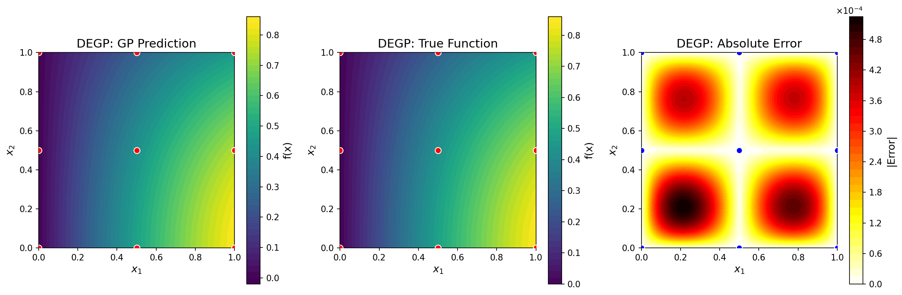
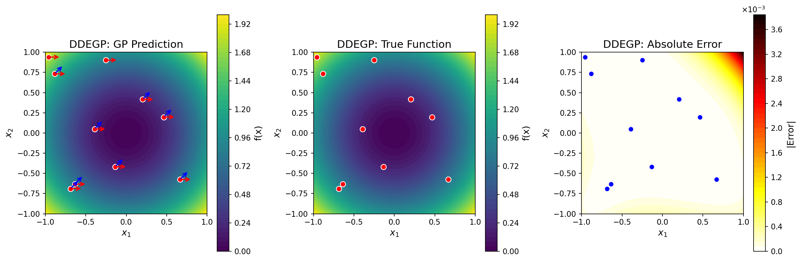
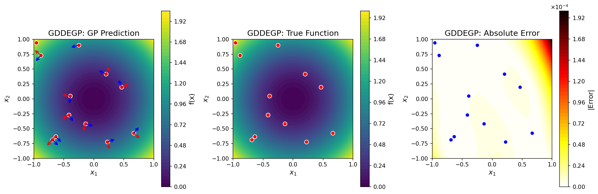
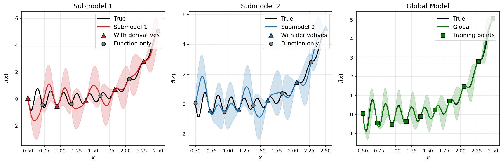
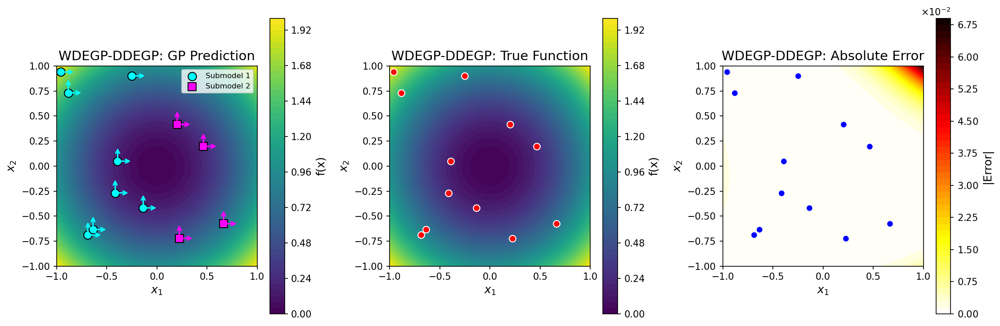
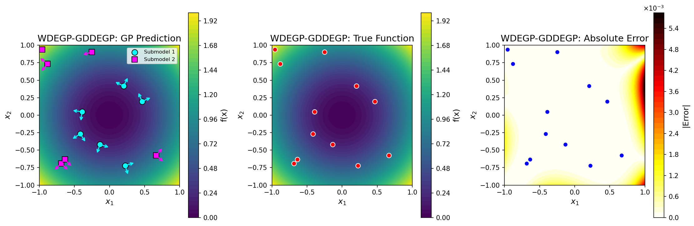

#####
JetGP
#####

A Gaussian Process library with support for arbitrary-order derivative-enhanced training data.

Module Overview
===============

JetGP provides four main modules for derivative-enhanced Gaussian Process modeling:

**Core Modules**

- **DEGP** (Derivative-Enhanced GP): Uses coordinate-aligned partial derivatives (∂f/∂x₁, ∂f/∂x₂, etc.). Best for problems where axis-aligned sensitivities are natural.

- **DDEGP** (Directional Derivative-Enhanced GP): Uses global directional derivatives with fixed ray directions applied at all (or a subset of) training points. Efficient when derivative information is available along consistent directions across the domain.

- **GDDEGP** (Generalized Directional Derivative-Enhanced GP): Uses point-wise directional derivatives where each training point can have unique ray directions. Ideal for adaptive methods where derivative directions vary spatially (e.g., gradient-aligned sampling).

**Unified Submodeling Framework**

- **WDEGP** (Weighted Derivative-Enhanced GP): A unified framework for combining multiple submodels, each trained on different subsets of training points with different derivative configurations. Supports submodeling with any of the core module types via the ``submodel_type`` parameter (``'degp'``, ``'ddegp'``, or ``'gddegp'``).

.. list-table:: Module Comparison
   :header-rows: 1
   :widths: 20 25 25 30

   * - Module
     - Derivative Type
     - Ray Specification
     - Use Case
   * - DEGP
     - Partial derivatives
     - N/A (coordinate-aligned)
     - Standard derivative data
   * - DDEGP
     - Directional derivatives
     - Global ``rays`` array
     - Fixed directions across domain
   * - GDDEGP
     - Directional derivatives
     - Point-wise ``rays_list``
     - Spatially-varying directions
   * - WDEGP
     - Any of the above
     - Depends on ``submodel_type``
     - Partitioned training data

Installation
============

Anaconda
--------

Ensure that the Anaconda distribution is installed on your system. `Click here <https://www.anaconda.com/docs/getting-started/anaconda/install>`_ for installation steps.

Cloning the repository
----------------------

.. code-block:: bash

   $ git clone git@github.com:Samm-Py/jetgp.git

Conda environment
-----------------

Set up the dependencies of this repository using the ``environment.yml`` file.

1. Go to the root of the cloned repository. Create and activate the conda environment with the supplied ``environment.yml`` file at root:

.. code-block:: bash

   $ cd <path-to-JetGP>
   $ conda env create -f environment.yml
   $ conda activate jetgp

In the event where dependencies are added, the ``jetgp`` environment can be updated:

.. code-block:: bash

   $ conda env update --file environment.yml --prune

Add JetGP to Python Path
------------------------

To make the ``jetgp`` library importable from anywhere, it must be added to your Python path.  
There are two recommended ways to do this:

**Option 1: Temporary addition using ``PYTHONPATH``**

.. code-block:: bash

   # From  ``.\jetgp-main``
   $ export PYTHONPATH=$PYTHONPATH:$(pwd)

   # Optional: verify that JetGP is accessible
   $ python -c "import jetgp; print('JetGP successfully added to PYTHONPATH')"

To make this change permanent, add the export line to your shell configuration file (e.g., ``~/.bashrc`` or ``~/.zshrc``).

**Option 2: Persistent addition using Conda (recommended for Anaconda users)**

If using Anaconda, you can register the repository path with your environment using ``conda develop``  

.. code-block:: bash

   $ cd <path-to-JetGP> (e.g., ``.\jetgp-main``).
   $ conda develop .

This method automatically makes ``jetgp`` importable whenever the ``jetgp`` environment is active.

Local documentation build
=========================

The documentation of the library can be built locally.

1. Ensure that the conda environment is activated:

.. code-block:: bash

   $ conda activate jetgp

2. Change directory to the ``docs`` directory and make a ``build`` directory:

.. code-block:: bash

   $ cd docs
   $ mkdir build

3. Build and open the HTML documentation (e.g., using Firefox browser):

.. code-block:: bash

   $ sphinx-build -M html source build
   $ cd build/html
   $ firefox index.html

Quick Start Examples
====================

DEGP: Derivative-Enhanced Gaussian Process
------------------------------------------

DEGP uses coordinate-aligned partial derivatives (∂f/∂x₁, ∂²f/∂x₁², etc.) for training.

This example demonstrates DEGP on the 2D function :math:`f(x_1, x_2) = \sin(x_1)\cos(x_2)` using a 3×3 training grid with first and second-order coordinate derivatives.

.. code-block:: python

   import numpy as np
   from jetgp.full_degp.degp import degp
   import matplotlib.pyplot as plt

   # Generate 3x3 training grid
   X1 = np.array([0.0, 0.5, 1.0])
   X2 = np.array([0.0, 0.5, 1.0])
   X1_grid, X2_grid = np.meshgrid(X1, X2)
   X_train = np.column_stack([X1_grid.flatten(), X2_grid.flatten()])

   # Compute function values and derivatives for f(x,y) = sin(x)cos(y)
   y_func = np.sin(X_train[:,0]) * np.cos(X_train[:,1])
   y_deriv_x = np.cos(X_train[:,0]) * np.cos(X_train[:,1])
   y_deriv_y = -np.sin(X_train[:,0]) * np.sin(X_train[:,1])
   y_deriv_xx = -np.sin(X_train[:,0]) * np.cos(X_train[:,1])
   y_deriv_yy = -np.sin(X_train[:,0]) * np.cos(X_train[:,1])

   # Organize training data
   y_train = [y_func.reshape(-1,1), y_deriv_x.reshape(-1,1),
              y_deriv_y.reshape(-1,1), y_deriv_xx.reshape(-1,1),
              y_deriv_yy.reshape(-1,1)]

   # Specify derivative structure
   der_indices = [[[[1,1]], [[2,1]]],  # First-order: df/dx1, df/dx2
                  [[[1,2]], [[2,2]]]]  # Second-order: d²f/dx1², d²f/dx2²

   # Specify derivative locations: all derivatives at all training points
   derivative_locations = []
   for i in range(len(der_indices)):
       for j in range(len(der_indices[i])):
           derivative_locations.append([k for k in range(len(X_train))])

.. code-block:: python

   # Initialize and optimize
   model = degp(X_train, y_train, n_order=2, n_bases=2,
                der_indices=der_indices,
                derivative_locations=derivative_locations,
                normalize=True,
                kernel="SE", kernel_type="anisotropic")

   params = model.optimize_hyperparameters(optimizer='jade',
                                           pop_size=100,
                                           n_generations=15)

.. code-block:: python

   # Predict on test grid
   x_test = np.linspace(0, 1, 50)
   X1_test, X2_test = np.meshgrid(x_test, x_test)
   X_test = np.column_stack([X1_test.flatten(), X2_test.flatten()])
   y_pred = model.predict(X_test, params, return_deriv=False)

   # Compute error
   y_true = np.sin(X_test[:,0]) * np.cos(X_test[:,1])
   abs_error = np.abs(y_true - y_pred.flatten())

   print(f"Mean absolute error: {np.mean(abs_error):.6f}")
   print(f"Max absolute error: {np.max(abs_error):.6f}")

   GP prediction (left), true function (center), and absolute error (right) for :math:`f(x_1, x_2) = \sin(x_1)\cos(x_2)` using first and second-order coordinate-wise partial derivatives at nine regularly-spaced training points.

---

DDEGP: Directional Derivative-Enhanced Gaussian Process
-------------------------------------------------------

DDEGP uses directional derivatives along global ray directions that are consistent across training points.

This example demonstrates DDEGP on the 2D function :math:`f(x_1, x_2) = x_1^2 + x_2^2` using two global directional derivative directions applied at all training points.

**Key feature:** The ``rays`` parameter specifies global directions with shape ``(d, n_directions)``. 
The ``derivative_locations`` parameter specifies which points have which directions.

.. code-block:: python

   import numpy as np
   from jetgp.full_ddegp.ddegp import ddegp
   
   # Generate 2D training data: f(x,y) = x^2 + y^2
   np.random.seed(42)
   X_train = np.random.rand(10, 2) * 2 - 1  # [-1, 1]^2
   y_vals = np.sum(X_train**2, axis=1)

.. code-block:: python

   # Define two GLOBAL directional derivative directions
   rays = np.array([
       [1.0, 0.5],   # x-components
       [0.0, 0.5]    # y-components  
   ])
   
   # Normalize direction vectors to unit length
   for i in range(rays.shape[1]):
       rays[:, i] = rays[:, i] / np.linalg.norm(rays[:, i])
   
   # derivative_locations: which points have which directions
   # Here both directions at all 10 training points
   num_pts = len(X_train)
   derivative_locations = [
       list(range(num_pts)),  # Direction 1 at all points
       list(range(num_pts))   # Direction 2 at all points
   ]
   
   # Compute directional derivatives: grad(f) · ray = 2*X · ray
   dy_dray1 = np.sum(2*X_train * rays[:,0].reshape(1,-1), axis=1)
   dy_dray2 = np.sum(2*X_train * rays[:,1].reshape(1,-1), axis=1)
   
   Y_train = [y_vals.reshape(-1,1),
              dy_dray1.reshape(-1,1),
              dy_dray2.reshape(-1,1)]
   
   # Specify directional derivative structure
   der_indices = [[[[1,1]], [[2,1]]]]  # Two directions, first-order

.. code-block:: python

   # Initialize and optimize
   model = ddegp(X_train, Y_train, n_order=1,
                 der_indices=der_indices, 
                 derivative_locations=derivative_locations,
                 rays=rays,
                 normalize=True, kernel="SE", 
                 kernel_type="anisotropic")
   
   params = model.optimize_hyperparameters(optimizer='lbfgs', n_restarts=5)

.. code-block:: python

   # Predict on grid
   x_test = np.linspace(-1, 1, 50)
   X1, X2 = np.meshgrid(x_test, x_test)
   X_test = np.column_stack([X1.flatten(), X2.flatten()])
   
   y_pred_full = model.predict(X_test, params, calc_cov=False, return_deriv=False)
   y_pred = y_pred_full[0, :]  # Row 0: function values
   
   # Compute error
   y_true = np.sum(X_test**2, axis=1)
   abs_error = np.abs(y_true - y_pred)
   
   print(f"Mean absolute error: {np.mean(abs_error):.6f}")
   print(f"Max absolute error: {np.max(abs_error):.6f}")

   GP prediction (left), true function (center), and absolute error (right) for :math:`f(x_1, x_2) = x_1^2 + x_2^2` using two global directional derivatives (shown as red and blue arrows) at ten randomly-placed training points. The directional rays are the same at all training locations.

---

GDDEGP: Generalized Directional Derivative-Enhanced Gaussian Process
--------------------------------------------------------------------

GDDEGP uses point-wise directional derivatives where each training point can have unique ray directions.

This example demonstrates GDDEGP on the 2D function :math:`f(x_1, x_2) = x_1^2 + x_2^2` using gradient-aligned and perpendicular directions that adapt to each location.

**Key feature:** The ``rays_list`` parameter contains arrays where ``rays_list[i][:, j]`` is the 
ray direction for point ``derivative_locations[i][j]``. Each column corresponds to a specific point.

.. code-block:: python

   import numpy as np
   from jetgp.full_gddegp.gddegp import gddegp
   
   # Generate 2D training data: f(x,y) = x^2 + y^2
   np.random.seed(42)
   X_train = np.random.rand(12, 2) * 2 - 1  # [-1, 1]^2
   y_vals = np.sum(X_train**2, axis=1)

.. code-block:: python

   # Create POINT-WISE gradient and perpendicular directions
   n_points = len(X_train)
   
   # derivative_locations: all points have both directions
   derivative_locations = [
       list(range(n_points)),  # Direction 1 at all points
       list(range(n_points))   # Direction 2 at all points
   ]
   
   # Build rays_list: one array per direction
   # rays_list[i][:, j] is the ray for point derivative_locations[i][j]
   rays_dir1_list = []
   rays_dir2_list = []
   
   for i in range(n_points):
       # Gradient direction: [2x, 2y]
       gradient = 2 * X_train[i]
       grad_norm = np.linalg.norm(gradient)
       
       if grad_norm < 1e-10:
           ray1 = np.array([1.0, 0.0])
           ray2 = np.array([0.0, 1.0])
       else:
           # Direction 1: normalized gradient
           ray1 = gradient / grad_norm
           # Direction 2: perpendicular (rotate 90 degrees)
           ray2 = np.array([-ray1[1], ray1[0]])
       
       rays_dir1_list.append(ray1)
       rays_dir2_list.append(ray2)
   
   rays_list = [
       np.column_stack(rays_dir1_list),  # Shape: (2, n_points)
       np.column_stack(rays_dir2_list)   # Shape: (2, n_points)
   ]

.. code-block:: python

   # Compute directional derivatives
   dy_dray1 = np.array([np.dot(2*X_train[i], rays_list[0][:,i])
                        for i in range(n_points)])
   dy_dray2 = np.array([np.dot(2*X_train[i], rays_list[1][:,i])
                        for i in range(n_points)])
   
   y_train = [y_vals.reshape(-1,1), 
              dy_dray1.reshape(-1,1),
              dy_dray2.reshape(-1,1)]
   
   # der_indices: two first-order directional derivatives
   der_indices = [[[[1,1]], [[2,1]]]]

.. code-block:: python

   # Initialize and optimize
   model = gddegp(X_train, y_train, n_order=1,
                  rays_list=rays_list,
                  derivative_locations=derivative_locations,
                  der_indices=der_indices,
                  normalize=True, kernel="SE",
                  kernel_type="anisotropic")
   
   params = model.optimize_hyperparameters(optimizer='lbfgs', n_restarts=5)

.. code-block:: python

   # Predict on grid (no rays needed for function-only prediction)
   x_test = np.linspace(-1, 1, 50)
   X1, X2 = np.meshgrid(x_test, x_test)
   X_test = np.column_stack([X1.flatten(), X2.flatten()])
   
   y_pred_full = model.predict(X_test, params, calc_cov=False, return_deriv=False)
   y_pred = y_pred_full[0, :]
   
   # Compute error
   y_true = np.sum(X_test**2, axis=1)
   abs_error = np.abs(y_true - y_pred)
   
   print(f"Mean absolute error: {np.mean(abs_error):.6f}")
   print(f"Max absolute error: {np.max(abs_error):.6f}")

.. code-block:: python

   # Predict derivatives at training points (requires rays_predict)
   y_pred_deriv = model.predict(
       X_train, params,
       rays_predict=rays_list,
       calc_cov=False,
       return_deriv=True
   )
   
   # Output shape: [3, n_points]
   # Row 0: function values
   # Row 1: Direction 1 derivatives
   # Row 2: Direction 2 derivatives

   GP prediction (left), true function (center), and absolute error (right) for :math:`f(x_1, x_2) = x_1^2 + x_2^2` using point-specific directional derivatives. At each training point, two orthogonal directions are used: one aligned with the local gradient (red arrows) and one perpendicular (blue arrows). Unlike DDEGP, the directions adapt to local function behavior.

---

WDEGP: Weighted Derivative-Enhanced Gaussian Process
----------------------------------------------------

WDEGP is a unified framework for combining multiple submodels trained on different subsets of 
training points. It supports submodeling with any of the core module types through the 
``submodel_type`` parameter:

- ``submodel_type='degp'``: Submodels use coordinate-aligned partial derivatives
- ``submodel_type='ddegp'``: Submodels use global directional derivatives (requires ``rays``)
- ``submodel_type='gddegp'``: Submodels use point-wise directional derivatives (requires ``rays_list``)

**Important:** Derivative locations must be disjoint across submodels. If submodel 1 has derivative 
information at point index ``i``, submodel 2 cannot have derivative information at the same point.

Example 1: WDEGP with DEGP Submodels
~~~~~~~~~~~~~~~~~~~~~~~~~~~~~~~~~~~~

This example uses coordinate-aligned partial derivatives with two submodels on alternating points.

.. code-block:: python

   import numpy as np
   from jetgp.wdegp.wdegp import wdegp

   # Define test function: f(x) = sin(10*pi*x)/(2*x) + (x-1)^4
   def f_fun(x):
       return np.sin(10*np.pi*x)/(2*x) + (x-1)**4

   def f1_fun(x):  # First derivative
       return (10*np.pi*np.cos(10*np.pi*x))/(2*x) - \
              np.sin(10*np.pi*x)/(2*x**2) + 4*(x-1)**3

   def f2_fun(x):  # Second derivative
       return -(100*np.pi**2*np.sin(10*np.pi*x))/(2*x) - \
              (20*np.pi*np.cos(10*np.pi*x))/(2*x**2) + \
              np.sin(10*np.pi*x)/(x**3) + 12*(x-1)**2

   # Generate training points
   X_train = np.linspace(0.5, 2.5, 10).reshape(-1, 1)

   # Partition into DISJOINT submodels with alternating indices
   submodel1_indices = [0, 2, 4, 6, 8]
   submodel2_indices = [1, 3, 5, 7, 9]

   # Function values at ALL training points
   y_vals = f_fun(X_train.flatten()).reshape(-1, 1)

.. code-block:: python

   # Compute derivatives for each submodel at their specific indices
   d1_sm1 = np.array([[f1_fun(X_train[i, 0])] for i in submodel1_indices])
   d2_sm1 = np.array([[f2_fun(X_train[i, 0])] for i in submodel1_indices])
   d1_sm2 = np.array([[f1_fun(X_train[i, 0])] for i in submodel2_indices])
   d2_sm2 = np.array([[f2_fun(X_train[i, 0])] for i in submodel2_indices])

   # Package submodel data
   y_train = [
       [y_vals, d1_sm1, d2_sm1],  # Submodel 1
       [y_vals, d1_sm2, d2_sm2]   # Submodel 2
   ]

   # Derivative locations: MUST be disjoint across submodels
   derivative_locations = [
       [submodel1_indices, submodel1_indices],  # Submodel 1
       [submodel2_indices, submodel2_indices]   # Submodel 2
   ]

   # Derivative specifications for each submodel
   der_indices = [
       [[[[1, 1]]], [[[1, 2]]]],  # Submodel 1: 1st and 2nd order in dim 1
       [[[[1, 1]]], [[[1, 2]]]]   # Submodel 2: 1st and 2nd order in dim 1
   ]

.. code-block:: python

   # Initialize with submodel_type='degp' (default)
   model = wdegp(X_train, y_train, n_order=2, n_bases=1,
                 derivative_locations=derivative_locations,
                 der_indices=der_indices,
                 submodel_type='degp',
                 normalize=True, kernel="SE", 
                 kernel_type="anisotropic")

   params = model.optimize_hyperparameters(optimizer='jade',
                                           pop_size=100,
                                           n_generations=15)

.. code-block:: python

   # Predict with submodel outputs
   X_test = np.linspace(0.5, 2.5, 250).reshape(-1, 1)
   y_pred, y_cov, submodel_preds, submodel_covs = model.predict(
       X_test, params, calc_cov=True, return_submodels=True
   )

   # Compute error
   y_true = f_fun(X_test.flatten())
   abs_error = np.abs(y_true.flatten() - y_pred.flatten())

   print(f"Mean absolute error: {np.mean(abs_error):.6f}")

   Comparison of submodel and global predictions for a 1D test function using DEGP submodels.

Example 2: WDEGP with DDEGP Submodels
~~~~~~~~~~~~~~~~~~~~~~~~~~~~~~~~~~~~~

This example uses global directional derivatives with two spatially-partitioned submodels.

.. code-block:: python

   import numpy as np
   from jetgp.wdegp.wdegp import wdegp

   # Generate 2D training data: f(x,y) = x^2 + y^2
   np.random.seed(42)
   X_train = np.random.rand(12, 2) * 2 - 1
   y_vals = np.sum(X_train**2, axis=1).reshape(-1, 1)

   # Define global rays (same at all points)
   rays = np.array([
       [1.0, 0.0],   # x-components: ray1 along x, ray2 along y
       [0.0, 1.0]    # y-components
   ])

   # DISJOINT submodels: left half vs right half
   sm1_indices = [i for i in range(len(X_train)) if X_train[i, 0] < 0]
   sm2_indices = [i for i in range(len(X_train)) if X_train[i, 0] >= 0]

.. code-block:: python

   # Compute directional derivatives for each submodel
   dy_ray1_sm1 = (2 * X_train[sm1_indices, 0] * rays[0, 0] + 
                  2 * X_train[sm1_indices, 1] * rays[1, 0]).reshape(-1, 1)
   dy_ray2_sm1 = (2 * X_train[sm1_indices, 0] * rays[0, 1] + 
                  2 * X_train[sm1_indices, 1] * rays[1, 1]).reshape(-1, 1)

   dy_ray1_sm2 = (2 * X_train[sm2_indices, 0] * rays[0, 0] + 
                  2 * X_train[sm2_indices, 1] * rays[1, 0]).reshape(-1, 1)
   dy_ray2_sm2 = (2 * X_train[sm2_indices, 0] * rays[0, 1] + 
                  2 * X_train[sm2_indices, 1] * rays[1, 1]).reshape(-1, 1)

   y_train = [
       [y_vals, dy_ray1_sm1, dy_ray2_sm1],  # Submodel 1
       [y_vals, dy_ray1_sm2, dy_ray2_sm2]   # Submodel 2
   ]

   der_indices = [
       [[[[1, 1]], [[2, 1]]]],  # Submodel 1: 2 directions
       [[[[1, 1]], [[2, 1]]]]   # Submodel 2: 2 directions
   ]

   derivative_locations = [
       [sm1_indices, sm1_indices],  # Submodel 1
       [sm2_indices, sm2_indices]   # Submodel 2
   ]

.. code-block:: python

   # Initialize with submodel_type='ddegp'
   model = wdegp(
       X_train, y_train, n_order=1, n_bases=2,
       der_indices=der_indices,
       derivative_locations=derivative_locations,
       submodel_type='ddegp',
       rays=rays,
       normalize=True, kernel="SE", kernel_type="anisotropic"
   )

   params = model.optimize_hyperparameters(
       optimizer='pso', pop_size=200, n_generations=15
   )

.. code-block:: python

   # Predict
   x_test = np.linspace(-1, 1, 50)
   X1, X2 = np.meshgrid(x_test, x_test)
   X_test = np.column_stack([X1.ravel(), X2.ravel()])

   y_pred = model.predict(X_test, params, calc_cov=False)
   y_true = np.sum(X_test**2, axis=1)

   print(f"Mean absolute error: {np.mean(np.abs(y_true - y_pred.flatten())):.6f}")

   Comparison of submodel and global predictions for a 1D test function using DEGP submodels.

Example 3: WDEGP with GDDEGP Submodels
~~~~~~~~~~~~~~~~~~~~~~~~~~~~~~~~~~~~~~

This example uses point-wise directional derivatives with gradient-aligned rays.

.. code-block:: python

   import numpy as np
   from jetgp.wdegp.wdegp import wdegp

   # Generate 2D training data: f(x,y) = x^2 + y^2
   np.random.seed(42)
   X_train = np.random.rand(12, 2) * 2 - 1
   y_vals = np.sum(X_train**2, axis=1).reshape(-1, 1)

   # DISJOINT submodels based on distance from origin
   distances = np.linalg.norm(X_train, axis=1)
   median_dist = np.median(distances)
   sm1_indices = [i for i in range(len(X_train)) if distances[i] < median_dist]
   sm2_indices = [i for i in range(len(X_train)) if distances[i] >= median_dist]

.. code-block:: python

   # Build point-wise rays for each submodel
   def build_rays(indices):
       n = len(indices)
       rays_dir1 = np.zeros((2, n))
       rays_dir2 = np.zeros((2, n))
       dy_dir1 = np.zeros((n, 1))
       dy_dir2 = np.zeros((n, 1))
       
       for j, idx in enumerate(indices):
           grad = 2 * X_train[idx]
           grad_norm = np.linalg.norm(grad)
           
           if grad_norm < 1e-10:
               rays_dir1[:, j] = [1, 0]
               rays_dir2[:, j] = [0, 1]
           else:
               rays_dir1[:, j] = grad / grad_norm
               rays_dir2[:, j] = [-rays_dir1[1, j], rays_dir1[0, j]]
           
           dy_dir1[j] = np.dot(grad, rays_dir1[:, j])
           dy_dir2[j] = np.dot(grad, rays_dir2[:, j])
       
       return rays_dir1, rays_dir2, dy_dir1, dy_dir2

   rays_dir1_sm1, rays_dir2_sm1, dy_dir1_sm1, dy_dir2_sm1 = build_rays(sm1_indices)
   rays_dir1_sm2, rays_dir2_sm2, dy_dir1_sm2, dy_dir2_sm2 = build_rays(sm2_indices)

   # rays_list: one entry per submodel, containing rays for each direction
   rays_list = [
       [rays_dir1_sm1, rays_dir2_sm1],  # Submodel 1
       [rays_dir1_sm2, rays_dir2_sm2]   # Submodel 2
   ]

   y_train = [
       [y_vals, dy_dir1_sm1, dy_dir2_sm1],
       [y_vals, dy_dir1_sm2, dy_dir2_sm2]
   ]

   der_indices = [
       [[[[1, 1]], [[2, 1]]]],
       [[[[1, 1]], [[2, 1]]]]
   ]

   derivative_locations = [
       [sm1_indices, sm1_indices],
       [sm2_indices, sm2_indices]
   ]

.. code-block:: python

   # Initialize with submodel_type='gddegp'
   model = wdegp(
       X_train, y_train, n_order=1, n_bases=2,
       der_indices=der_indices,
       derivative_locations=derivative_locations,
       submodel_type='gddegp',
       rays_list=rays_list,
       normalize=True, kernel="SE", kernel_type="anisotropic"
   )

   params = model.optimize_hyperparameters(
       optimizer='pso', pop_size=200, n_generations=15
   )

.. code-block:: python

   # Predict (function values only - no rays_predict needed)
   x_test = np.linspace(-1, 1, 50)
   X1, X2 = np.meshgrid(x_test, x_test)
   X_test = np.column_stack([X1.ravel(), X2.ravel()])

   y_pred = model.predict(X_test, params, calc_cov=False)
   y_true = np.sum(X_test**2, axis=1)

   print(f"Mean absolute error: {np.mean(np.abs(y_true - y_pred.flatten())):.6f}")

.. code-block:: python

   # Predict derivatives at training points (requires rays_predict)
   # Build rays_predict for all training points
   rays_dir1_all = np.zeros((2, len(X_train)))
   rays_dir2_all = np.zeros((2, len(X_train)))

   for j, idx in enumerate(sm1_indices):
       rays_dir1_all[:, idx] = rays_dir1_sm1[:, j]
       rays_dir2_all[:, idx] = rays_dir2_sm1[:, j]
   for j, idx in enumerate(sm2_indices):
       rays_dir1_all[:, idx] = rays_dir1_sm2[:, j]
       rays_dir2_all[:, idx] = rays_dir2_sm2[:, j]

   rays_predict = [rays_dir1_all, rays_dir2_all]

   y_pred_deriv, _ = model.predict(
       X_train, params,
       rays_predict=rays_predict,
       calc_cov=True,
       return_deriv=True
   )

