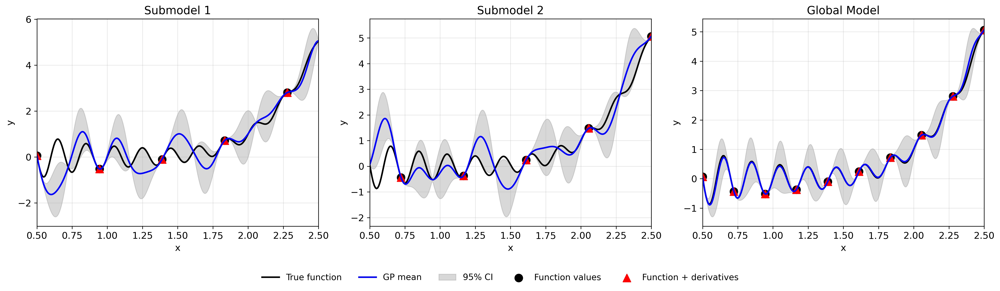
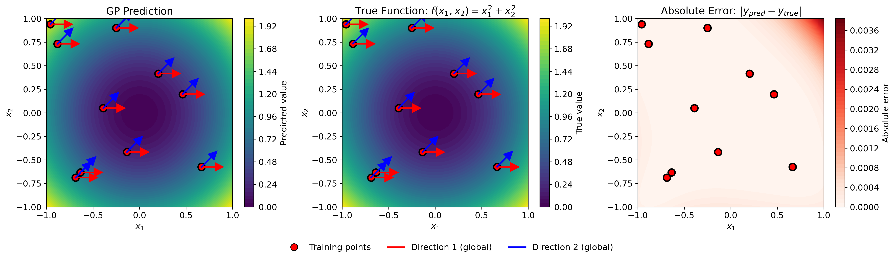
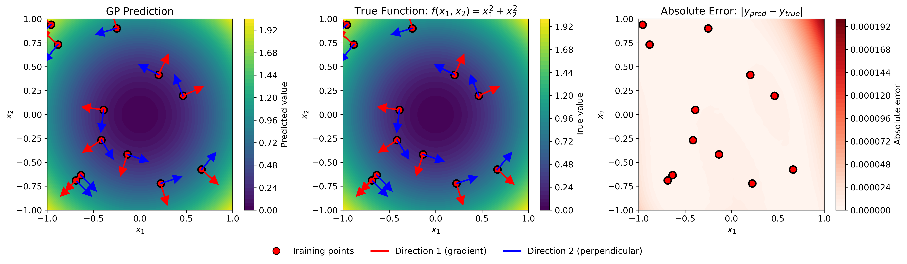
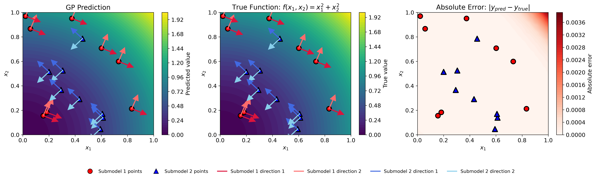

#####
JetGP
#####

A Gaussian Process library with support for arbitrary-order derivative-enhanced training data.

Installation
============

Anaconda
--------

Ensure that the Anaconda distribution is installed on your system. `Click here <https://www.anaconda.com/docs/getting-started/anaconda/install>`_ for installation steps.

Cloning the repository
----------------------

.. code-block:: bash

   $ git clone git@github.com:Samm-Py/jetgp.git

Conda environment
-----------------

Set up the dependencies of this repository using the ``environment.yml`` file.

1. Go to the root of the cloned repository. Create and activate the conda environment with the supplied ``environment.yml`` file at root:

.. code-block:: bash

   $ cd <path-to-JetGP>
   $ conda env create -f environment.yml
   $ conda activate jetgp

In the event where dependencies are added, the ``jetgp`` environment can be updated:

.. code-block:: bash

   $ conda env update --file environment.yml --prune

Add JetGP to Python Path
------------------------

To make the ``jetgp`` library importable from anywhere, it must be added to your Python path.  
There are two recommended ways to do this:

**Option 1: Temporary addition using ``PYTHONPATH``**

.. code-block:: bash

   # From  ``.\jetgp-main``
   $ export PYTHONPATH=$PYTHONPATH:$(pwd)

   # Optional: verify that JetGP is accessible
   $ python -c "import jetgp; print('JetGP successfully added to PYTHONPATH')"

To make this change permanent, add the export line to your shell configuration file (e.g., ``~/.bashrc`` or ``~/.zshrc``).

**Option 2: Persistent addition using Conda (recommended for Anaconda users)**

If using Anaconda, you can register the repository path with your environment using ``conda develop``  
(from the ``conda-build`` package):

.. code-block:: bash

   $ conda install conda-build
   $ cd <path-to-JetGP> (e.g., ``.\jetgp-main``).
   $ conda develop .

This method automatically makes ``jetgp`` importable whenever the ``jetgp`` environment is active.

Local documentation build
=========================

The documentation of the library can be built locally.

1. Ensure that the conda environment is activated:

.. code-block:: bash

   $ conda activate jetgp

2. Change directory to the ``docs`` directory and make a ``build`` directory:

.. code-block:: bash

   $ cd docs
   $ mkdir build

3. Build and open the HTML documentation (e.g., using Firefox browser):

.. code-block:: bash

   $ sphinx-build -M html source build
   $ cd build/html
   $ firefox index.html

Quick Start Examples
=====================
DEGP: Derivative-Enhanced Gaussian Process
-------------------------------------------

This example demonstrates DEGP on the 2D function :math:`f(x_1, x_2) = \sin(x_1)\cos(x_2)` using a 3×3 training grid with first and second-order coordinate derivatives.

.. code-block:: python

   import numpy as np
   from jetgp.full_degp.degp import degp
   import matplotlib.pyplot as plt
   from matplotlib.lines import Line2D

   # Ensure proper matplotlib backend
   plt.rcParams.update({'font.size': 12})

   # Generate 3x3 training grid
   X1 = np.array([0.0, 0.5, 1.0])
   X2 = np.array([0.0, 0.5, 1.0])
   X1_grid, X2_grid = np.meshgrid(X1, X2)
   X_train = np.column_stack([X1_grid.flatten(), X2_grid.flatten()])

   # Compute function values and derivatives for f(x,y) = sin(x)cos(y)
   y_func = np.sin(X_train[:,0]) * np.cos(X_train[:,1])
   y_deriv_x = np.cos(X_train[:,0]) * np.cos(X_train[:,1])
   y_deriv_y = -np.sin(X_train[:,0]) * np.sin(X_train[:,1])
   y_deriv_xx = -np.sin(X_train[:,0]) * np.cos(X_train[:,1])
   y_deriv_yy = -np.sin(X_train[:,0]) * np.cos(X_train[:,1])

   # Organize training data
   y_train = [y_func.reshape(-1,1), y_deriv_x.reshape(-1,1),
              y_deriv_y.reshape(-1,1), y_deriv_xx.reshape(-1,1),
              y_deriv_yy.reshape(-1,1)]

   # Specify derivative structure
   der_indices = [[[[1,1]], [[2,1]]],  # First-order
                  [[[1,2]], [[2,2]]]]  # Second-order

   print("Initializing DEGP model...")

.. code-block:: python

   # Initialize and optimize
   model = degp(X_train, y_train, n_order=2, n_bases=2,
                der_indices=der_indices, normalize=True,
                kernel="SE", kernel_type="anisotropic")

   print("Optimizing hyperparameters...")
   params = model.optimize_hyperparameters(optimizer='jade',
                                            pop_size=100,
                                            n_generations=15)

   print("Optimization complete!")

.. code-block:: python

   # Predict on test grid
   x_test = np.linspace(0, 1, 50)
   X1_test, X2_test = np.meshgrid(x_test, x_test)
   X_test = np.column_stack([X1_test.flatten(), X2_test.flatten()])
   y_pred = model.predict(X_test, params, return_deriv=False)

   # Compute true function values
   y_true = np.sin(X_test[:,0]) * np.cos(X_test[:,1])

   # Compute absolute error
   abs_error = np.abs(y_true - y_pred.flatten())

   print(f"Mean absolute error: {np.mean(abs_error):.6f}")
   print(f"Max absolute error: {np.max(abs_error):.6f}")

.. figure:: ./_static/degp_sin_cos.png
   :alt: DEGP 2D example visualization
   :align: center
   :width: 100%

   GP prediction (left), true function (center), and absolute error (right) for :math:`f(x_1, x_2) = \sin(x_1)\cos(x_2)` using first and second-order coordinate-wise partial derivatives at nine regularly-spaced training points.

---

WDEGP: Weighted Derivative-Enhanced Gaussian Process
-----------------------------------------------------

This example demonstrates WDEGP on the 1D function :math:`f(x) = \frac{\sin(10\pi x)}{2x} + (x-1)^4`
using two submodels with alternating training points. Each submodel has access to function values and
first and second-order derivatives.

**Example code:**

.. code-block:: python

   import numpy as np
   from jetgp.wdegp.wdegp import wdegp
   import matplotlib.pyplot as plt

   plt.rcParams.update({'font.size': 12})

   # Define test function: f(x) = sin(10*pi*x)/(2*x) + (x-1)^4
   def f_fun(x):
       return np.sin(10*np.pi*x)/(2*x) + (x-1)**4

   def f1_fun(x):  # First derivative
       return (10*np.pi*np.cos(10*np.pi*x))/(2*x) - \
              np.sin(10*np.pi*x)/(2*x**2) + 4*(x-1)**3

   def f2_fun(x):  # Second derivative
       return -(100*np.pi**2*np.sin(10*np.pi*x))/(2*x) - \
              (20*np.pi*np.cos(10*np.pi*x))/(2*x**2) + \
              np.sin(10*np.pi*x)/(x**3) + 12*(x-1)**2

   # Generate training points
   X_all = np.linspace(0.5, 2.5, 10).reshape(-1, 1)

   # Partition into two submodels (alternating points)
   submodel1_indices = [0, 2, 4, 6, 8]
   submodel2_indices = [1, 3, 5, 7, 9]

   # Reorder for contiguous indexing
   X_train = np.vstack([X_all[submodel1_indices], 
                        X_all[submodel2_indices]])
   y_vals = f_fun(X_train.flatten()).reshape(-1, 1)

   print("Training data prepared with 2 submodels (5 points each)")

.. code-block:: python

   # Compute derivatives for each submodel
   d1_sm1 = np.array([[f1_fun(X_train[i,0])] for i in range(5)])
   d2_sm1 = np.array([[f2_fun(X_train[i,0])] for i in range(5)])
   d1_sm2 = np.array([[f1_fun(X_train[i,0])] for i in range(5,10)])
   d2_sm2 = np.array([[f2_fun(X_train[i,0])] for i in range(5,10)])

   # Package submodel data
   submodel_data = [
       [y_vals, d1_sm1, d2_sm1],  # Submodel 1
       [y_vals, d1_sm2, d2_sm2]   # Submodel 2
   ]

   submodel_indices = [[0,1,2,3,4], [5,6,7,8,9]]
   derivative_specs = [[[[[1,1]]], [[[1,2]]]], [[[[1,1]]], [[[1,2]]]]]

   print("Initializing WDEGP model...")

.. code-block:: python

   # Initialize and optimize
   model = wdegp(X_train, submodel_data, n_order=2, n_bases=1,
                 index=submodel_indices,
                 der_indices=derivative_specs,
                 normalize=True, kernel="SE", 
                 kernel_type="anisotropic")

   print("Optimizing hyperparameters...")
   params = model.optimize_hyperparameters(optimizer='jade',
                                            pop_size=100,
                                            n_generations=15)

   print("Optimization complete!")

.. code-block:: python

   # Predict
   X_test = np.linspace(0.5, 2.5, 250).reshape(-1, 1)
   y_pred, y_cov, submodel_preds, submodel_covs = model.predict(
       X_test, params, calc_cov=True, return_submodels=True
   )

   # Predict individual submodels
   y_pred_sm1 = submodel_preds[0].flatten()
   y_cov_sm1  = submodel_covs[0].flatten()

   y_pred_sm2 = submodel_preds[1].flatten()
   y_cov_sm2  = submodel_covs[1].flatten()

   # Compute true function
   y_true = f_fun(X_test.flatten())

   # Compute confidence intervals (95%)
   std_global = np.sqrt(y_cov)
   std_sm1 = np.sqrt(y_cov_sm1)
   std_sm2 = np.sqrt(y_cov_sm2)

   print(f"Predictions complete for {len(X_test)} test points")

   Comparison of submodel and global predictions for a 1D test function.
   Left: Submodel 1 trained with derivatives on alternating points (red triangles)
   and function values only on remaining points (black circles).
   Center: Submodel 2 trained with the complementary partition of derivative
   information. Right: Global model combining information from both submodels,
   where all training points have associated derivative observations.
   The shaded regions represent 95\% confidence intervals.

DDEGP: Directional Derivative-Enhanced Gaussian Process
--------------------------------------------------------

This example demonstrates DDEGP on the 2D function :math:`f(x_1, x_2) = x_1^2 + x_2^2` using two global directional derivative directions applied at all training points. Unlike DEGP which uses coordinate-aligned derivatives, DDEGP allows arbitrary directional derivatives specified by ray vectors.

**Example code:**

.. code-block:: python

   import numpy as np
   from jetgp.full_ddegp.ddegp import ddegp
   import matplotlib.pyplot as plt
   
   # Generate 2D training data: f(x,y) = x^2 + y^2
   np.random.seed(42)
   X_train = np.random.rand(10, 2) * 2 - 1  # [-1, 1]^2
   y_vals = np.sum(X_train**2, axis=1)
   
   print(f"Generated {len(X_train)} training points")

.. code-block:: python

   # Define two global directional derivative directions
   rays = np.array([
       [1.0, 0.5],   # x-components
       [0.0, 0.5]    # y-components  
   ])
   
   # Normalize direction vectors to unit length
   for i in range(rays.shape[1]):
       rays[:, i] = rays[:, i] / np.linalg.norm(rays[:, i])
   
   # Compute directional derivatives: grad(f) · ray
   dy_dray1 = np.sum(2*X_train * rays[:,0].reshape(1,-1), axis=1)
   dy_dray2 = np.sum(2*X_train * rays[:,1].reshape(1,-1), axis=1)
   
   Y_train = [y_vals.reshape(-1,1),
              dy_dray1.reshape(-1,1),
              dy_dray2.reshape(-1,1)]
   
   # Specify directional derivative structure
   der_indices = [[[[1,1]], [[2,1]]]]  # Two directions
   
   print("Training data prepared with 2 directional derivatives per point")

.. code-block:: python

   # Initialize and optimize
   model = ddegp(X_train, Y_train, n_order=1,
                 der_indices=der_indices, rays=rays,
                 normalize=True, kernel="SE", 
                 kernel_type="anisotropic")
   
   print("Optimizing hyperparameters...")
   params = model.optimize_hyperparameters(optimizer='lbfgs', n_restarts=5)
   
   print("Optimization complete!")

.. code-block:: python

   # Predict on grid
   x_test = np.linspace(-1, 1, 50)
   X1, X2 = np.meshgrid(x_test, x_test)
   X_test = np.column_stack([X1.flatten(), X2.flatten()])
   y_pred = model.predict(X_test, params, calc_cov=False)
   
   # Compute true function and error
   y_true = np.sum(X_test**2, axis=1)
   abs_error = np.abs(y_true - y_pred.flatten())
   
   print(f"Mean absolute error: {np.mean(abs_error):.6f}")
   print(f"Max absolute error: {np.max(abs_error):.6f}")

   GP prediction (left), true function (center), and absolute error (right) for :math:`f(x_1, x_2) = x_1^2 + x_2^2` using two global directional derivatives (shown as red and blue arrows) at ten randomly-placed training points. The directional rays are the same at all training locations, enabling efficient computation while capturing non-axis-aligned function behavior.

   GDDEGP: Generalized Directional Derivative-Enhanced Gaussian Process
---------------------------------------------------------------------

This example demonstrates GDDEGP on the 2D function :math:`f(x_1, x_2) = x_1^2 + x_2^2` using point-specific directional derivatives. Unlike DDEGP which uses the same global directions everywhere, GDDEGP allows different directional derivatives at each training point. Here, we use gradient-aligned and perpendicular directions that adapt to each location.

**Example code:**

.. code-block:: python

   import numpy as np
   from jetgp.full_gddegp.gddegp import gddegp
   
   # Generate 2D training data: f(x,y) = x^2 + y^2
   np.random.seed(42)
   X_train = np.random.rand(12, 2) * 2 - 1  # [-1, 1]^2
   y_vals = np.sum(X_train**2, axis=1)
   
   print(f"Generated {len(X_train)} training points")

.. code-block:: python

   # Create gradient and perpendicular directions for each point
   n_points = len(X_train)
   rays_array = [np.zeros((2, n_points)), np.zeros((2, n_points))]
   
   for i in range(n_points):
       # Gradient direction: [2x, 2y]
       gradient = 2 * X_train[i]
       grad_norm = np.linalg.norm(gradient)
       
       # Direction 1: normalized gradient
       rays_array[0][:, i] = gradient / grad_norm
       
       # Direction 2: perpendicular (rotate 90 degrees)
       rays_array[1][0, i] = -rays_array[0][1, i]
       rays_array[1][1, i] = rays_array[0][0, i]
   
   print("Created point-specific gradient and perpendicular directions")

.. code-block:: python

   # Compute directional derivatives
   dy_dray1 = np.array([np.dot(2*X_train[i], rays_array[0][:,i])
                        for i in range(n_points)])
   dy_dray2 = np.array([np.dot(2*X_train[i], rays_array[1][:,i])
                        for i in range(n_points)])
   
   y_train = [y_vals.reshape(-1,1), dy_dray1.reshape(-1,1),
              dy_dray2.reshape(-1,1)]
   
   print("Directional derivatives computed")

.. code-block:: python

   # Initialize and optimize
   model = gddegp(X_train, y_train, n_order=1,
                  rays_array=rays_array,
                  der_indices=[[[[1,1]], [[2,1]]]],
                  normalize=True, kernel="SE",
                  kernel_type="anisotropic")
   
   print("Optimizing hyperparameters...")
   params = model.optimize_hyperparameters(optimizer='lbfgs', n_restarts=5)
   
   print("Optimization complete!")

.. code-block:: python

   # Predict on grid
   x_test = np.linspace(-1, 1, 50)
   X1, X2 = np.meshgrid(x_test, x_test)
   X_test = np.column_stack([X1.flatten(), X2.flatten()])
   
   # Dummy rays for prediction (not used for function values)
   dummy_rays = [np.ones((2, len(X_test))), np.ones((2, len(X_test)))]
   y_pred = model.predict(X_test, dummy_rays, params, return_deriv=False)
   
   # Compute true function and error
   y_true = np.sum(X_test**2, axis=1)
   abs_error = np.abs(y_true - y_pred.flatten())
   
   print(f"Mean absolute error: {np.mean(abs_error):.6f}")
   print(f"Max absolute error: {np.max(abs_error):.6f}")

   GP prediction (left), true function (center), and absolute error (right) for :math:`f(x_1, x_2) = x_1^2 + x_2^2` using point-specific directional derivatives. At each training point (red circles), two orthogonal directional derivatives are used: one aligned with the local gradient (red arrows pointing radially outward) and one perpendicular to it (blue arrows tangential to level curves). Unlike DDEGP where all arrows would be parallel, GDDEGP adapts the derivative directions to local function behavior.

WDDEGP: Weighted Directional Derivative-Enhanced Gaussian Process
------------------------------------------------------------------

This example demonstrates WDDEGP on the 2D function :math:`f(x_1, x_2) = x_1^2 + x_2^2` using two submodels with different directional derivative configurations. Each submodel has its own set of global directional rays, combining the computational efficiency of partitioning with the flexibility of directional derivatives.

**Example code:**

.. code-block:: python

   import numpy as np
   from jetgp.wddegp.wddegp import wddegp
   
   # Generate training data (16 points)
   np.random.seed(42)
   X_train = np.random.rand(16, 2)
   y_vals = X_train[:,0]**2 + X_train[:,1]**2
   
   # Partition into 2 submodels (8 points each)
   submodel_indices = [[0,1,2,3,4,5,6,7], [8,9,10,11,12,13,14,15]]
   
   print(f"Generated {len(X_train)} training points in 2 submodels")

.. code-block:: python

   # Define different directional derivatives for each submodel
   # Submodel 1: Two orthogonal directions at -22.5° and 67.5°
   # Submodel 2: Two orthogonal directions at 135° and 225°
   rays_data = [
       np.array([[np.cos(-np.pi/8), np.cos(-np.pi/8 + np.pi/2)], 
                 [np.sin(-np.pi/8), np.sin(-np.pi/8 + np.pi/2)]]),  # Submodel 1
       np.array([[np.cos(3*np.pi/4), np.cos(3*np.pi/4 + np.pi/2)], 
                 [np.sin(3*np.pi/4), np.sin(3*np.pi/4 + np.pi/2)]])   # Submodel 2
   ]
   
   print("Defined different directional rays for each submodel")

.. code-block:: python

   # Compute directional derivatives for each submodel
   # For f(x,y) = x^2 + y^2: grad f = [2x, 2y]
   grad_f = np.column_stack([2 * X_train[:,0], 2 * X_train[:,1]])
   
   # Submodel 1 - two directions
   v1_1 = rays_data[0][:, 0]
   v1_2 = rays_data[0][:, 1]
   dy_dray_sub1_dir1 = grad_f @ v1_1
   dy_dray_sub1_dir2 = grad_f @ v1_2
   
   # Submodel 2 - two directions
   v2_1 = rays_data[1][:, 0]
   v2_2 = rays_data[1][:, 1]
   dy_dray_sub2_dir1 = grad_f @ v2_1
   dy_dray_sub2_dir2 = grad_f @ v2_2
   
   y_train_data = [
       [y_vals.reshape(-1,1), 
        dy_dray_sub1_dir1[0:8].reshape(-1,1),
        dy_dray_sub1_dir2[0:8].reshape(-1,1)],
       [y_vals.reshape(-1,1), 
        dy_dray_sub2_dir1[8:16].reshape(-1,1),
        dy_dray_sub2_dir2[8:16].reshape(-1,1)]
   ]
   
   der_indices = [
       [[[[1, 1]], [[2, 1]]]],  # Submodel 1: two directional derivatives
       [[[[1, 1]], [[2, 1]]]]   # Submodel 2: two directional derivatives
   ]
   
   print("Directional derivatives computed for both submodels")

.. code-block:: python

   # Initialize and train
   model = wddegp(
       X_train, y_train_data, n_order=1, n_bases=2,
       index=submodel_indices,
       der_indices=der_indices, rays=rays_data,
       normalize=True, kernel="SE", kernel_type="anisotropic"
   )
   
   print("Optimizing hyperparameters...")
   params = model.optimize_hyperparameters(optimizer='pso', pop_size=200, 
                                            n_generations=15, debug=False)
   
   print("Optimization complete!")

.. code-block:: python

   # Make predictions on a grid
   x1 = np.linspace(0, 1, 50)
   x2 = np.linspace(0, 1, 50)
   X1, X2 = np.meshgrid(x1, x2)
   X_test = np.column_stack([X1.ravel(), X2.ravel()])
   y_pred = model.predict(X_test, params)
   
   # Compute true function and error
   y_true = X_test[:,0]**2 + X_test[:,1]**2
   abs_error = np.abs(y_true - y_pred.flatten())
   
   print(f"Mean absolute error: {np.mean(abs_error):.6f}")
   print(f"Max absolute error: {np.max(abs_error):.6f}")

   GP prediction (left), true function (center), and absolute error (right) for :math:`f(x_1, x_2) = x_1^2 + x_2^2` using two weighted submodels. Submodel 1 (first 8 points, cyan markers) uses directional derivatives at -22.5° and 67.5° (cyan arrows). Submodel 2 (remaining 8 points, magenta markers) uses directional derivatives at 135° and 225° (magenta arrows). Each submodel has its own directional configuration, and the final prediction combines both weighted submodels.
